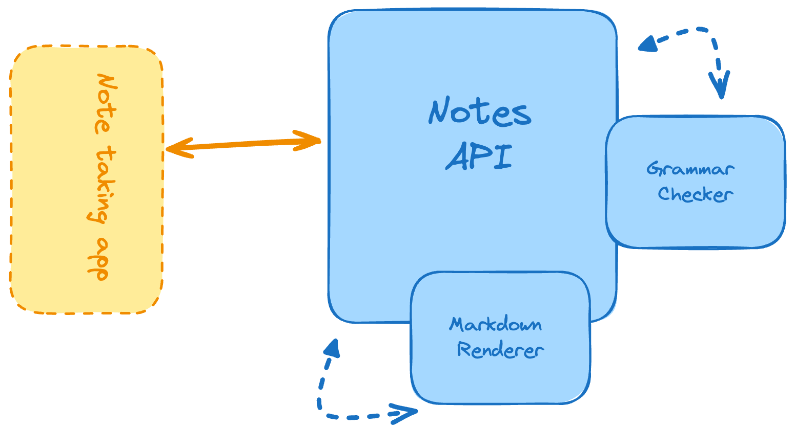

## Markdown Note-taking App

Build a simple note-taking app that lets users upload markdown files, check the grammar, save the note, and render it in HTML. 
The goal of this project is to help you learn how to handle file uploads in a RESTful API, parse and render markdown files using libraries, and check the grammar of the notes.

### Features

You have to implement the following features:
- You’ll provide an endpoint to check the grammar of the note.
- You’ll also provide an endpoint to save the note that can be passed in as Markdown text.
- Provide an endpoint to list the saved notes (i.e. uploaded markdown files).
- Return the HTML version of the Markdown note (rendered note) through another endpoint.

**Todo:**
- [X] Create a simple gin server
- [X] Add a simple home endpoint that response with a message `Welcome to Markdown parser`
- [X] Create an endpoint that lets users upload a markdown file.
- [X] Parse the markdown file and find spelling mistakes 
- [ ] Stream response instead of returning all at once. For better UX
- [ ] Add a simple UI to upload a markdown file and see the result.
- [ ] Add a simple UI to list all the uploaded markdown files.
- [ ] Add a simple UI to see the HTML version of the Markdown note.